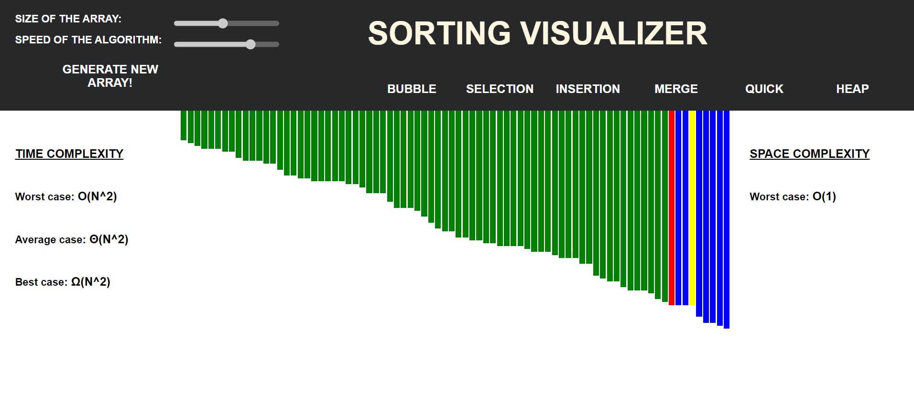

# Sorting Algorithms Visualizer

This project is built solely using HTML, CSS and Javascript. It helps in visualizing different sorting algorithms.

## Implemented algorithms:
 - Bubble sort
 - Selection sort
 - Insertion sort
 - Merge sort
 - Quick sort
 - Heap sort

## Features:
### 1. Colored representation of step being executed 
 - Blue : default
 - Yellow : Being compared
 - Red : Identified as in incorrect position and to be moved
 - Green: In correct position

### 2. Controls for visualizations 
 - Speed of visualization (5 speed levels)
 - Data size 
 - Generation of new data (Randomly generate new data).

### 3. Time and Space complexity of algorithm being visualized.

### 4. Public link:
https://sorting-algorithms-visualizer-three.vercel.app/

